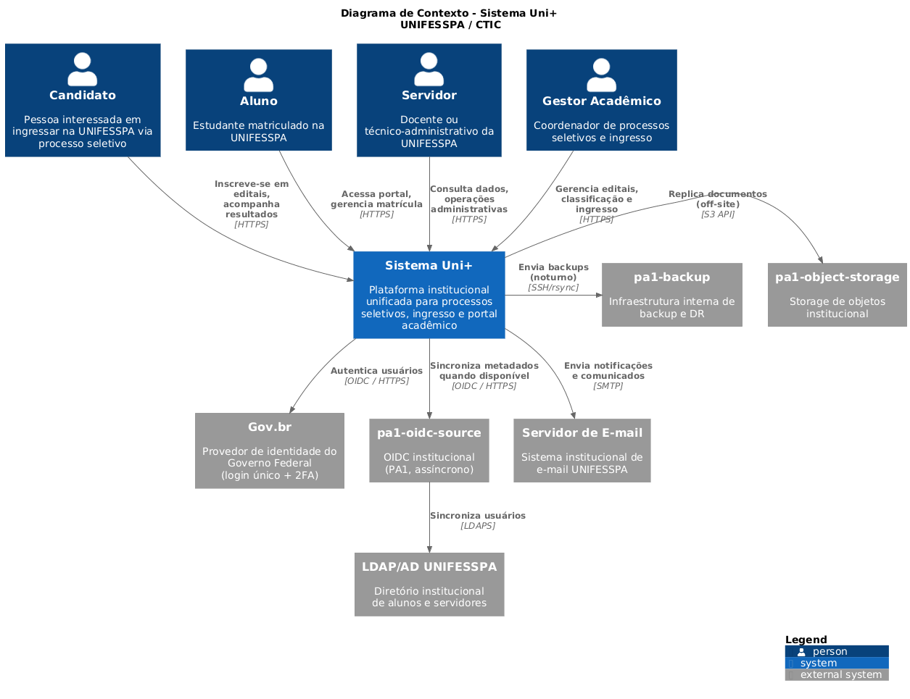
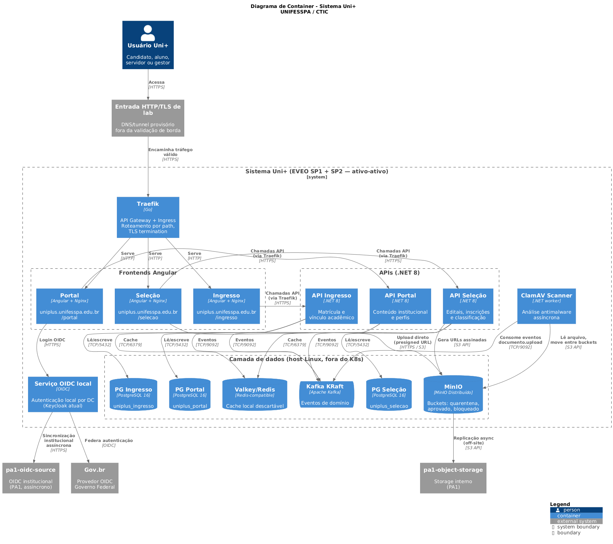
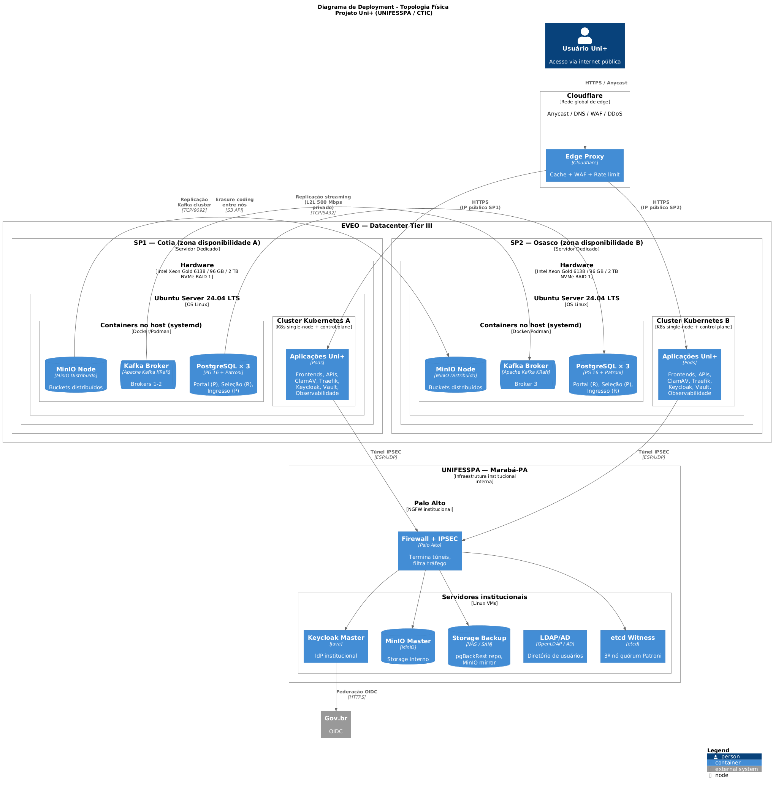
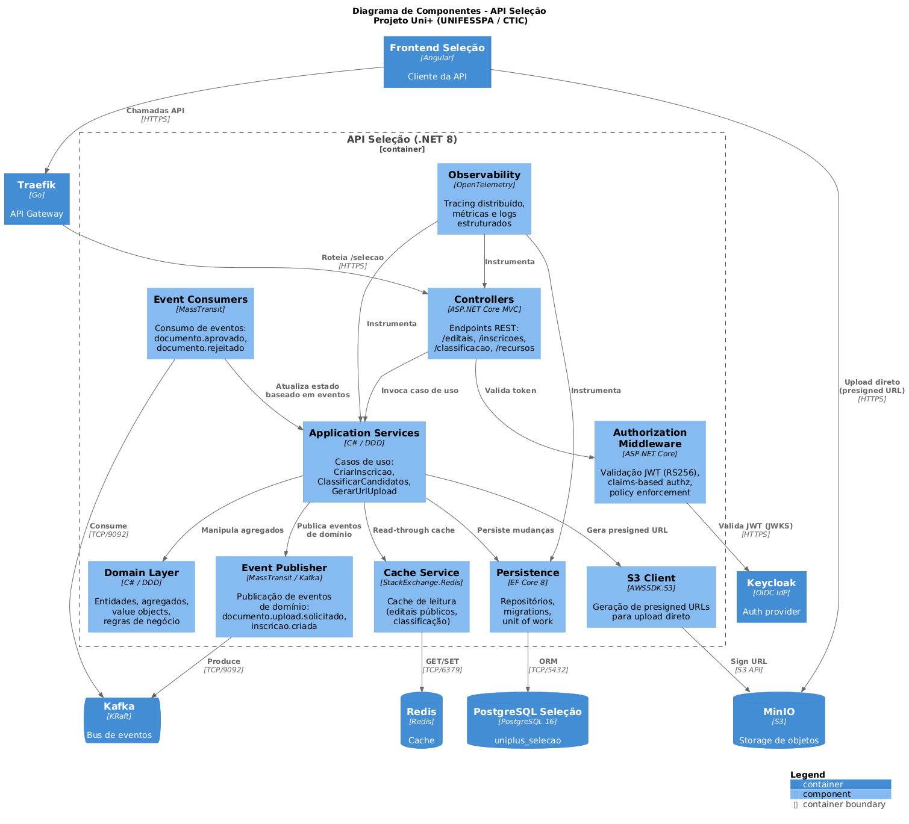
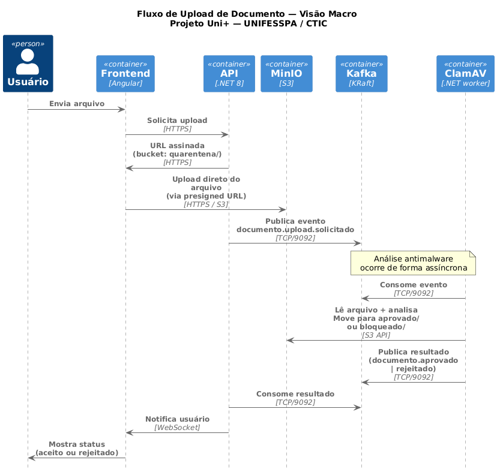
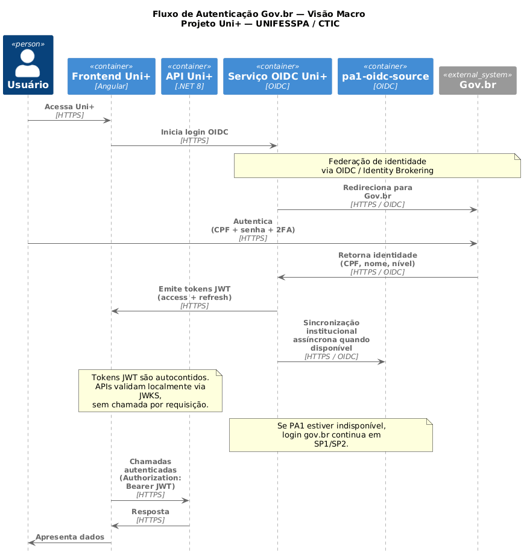

# Arquitetura da Plataforma Uni+

> Visão arquitetural completa do sistema Uni+ — UNIFESSPA / CTIC.

## Sumário

- [1. Contexto](#1-contexto)
- [2. Princípios Arquiteturais](#2-princípios-arquiteturais)
- [3. Visão de Contexto (C4 Nível 1)](#3-visão-de-contexto-c4-nível-1)
- [4. Visão de Container (C4 Nível 2)](#4-visão-de-container-c4-nível-2)
- [5. Topologia Física (C4 Deployment)](#5-topologia-física-c4-deployment)
- [6. Componentes Internos (C4 Nível 3)](#6-componentes-internos-c4-nível-3)
- [7. Fluxos Principais](#7-fluxos-principais)
- [8. Decisões Arquiteturais](#8-decisões-arquiteturais)
- [9. Estratégia por Componente](#9-estratégia-por-componente)
- [10. Mapeamento de Componentes](#10-mapeamento-de-componentes)

## 1. Contexto

A plataforma **Uni+** é o sistema institucional unificado da UNIFESSPA para processos seletivos, ingresso e portal acadêmico. Substitui sistemas legados fragmentados, oferecendo experiência única ao candidato, aluno, servidor e gestor, com integração ao login único do Governo Federal (Gov.br).

### 1.1 Módulos funcionais

| Módulo | Responsabilidade | Domínio público |
|--------|-----------------|-----------------|
| **Portal** | Conteúdo institucional, perfis, notificações | `uniplus.unifesspa.edu.br/portal` |
| **Seleção** | Editais, inscrições, classificação, recursos | `uniplus.unifesspa.edu.br/selecao` |
| **Ingresso** | Matrícula inicial, vínculo acadêmico | `uniplus.unifesspa.edu.br/ingresso` |

### 1.2 Requisitos não-funcionais

| Categoria | Requisito |
|-----------|-----------|
| Disponibilidade | ≥ 99,9% mensal (alvo combinado 99,95%) |
| Carga | 500 a 2.000 usuários simultâneos em pico de edital |
| RPO | ≤ 5 minutos |
| RTO | ≤ 1 hora |
| Segurança | Conformidade LGPD, criptografia em trânsito e repouso |
| Soberania | Hospedagem nacional, backup em infra UNIFESSPA |
| Identidade | Gov.br como provedor único, com 2FA obrigatório |

## 2. Princípios Arquiteturais

### 2.1 Microsserviços com comunicação assíncrona

A integração entre módulos ocorre via **eventos de domínio** publicados no Apache Kafka. Cada API tem seu próprio banco de dados (princípio Database per Service do DDD), eliminando acoplamento por compartilhamento de estado.

**Implicação:** falha em um módulo não derruba os demais. Eventos podem ser reprocessados após restauração.

### 2.2 Independência operacional entre datacenters

A plataforma é modelada como **3 DCs lógicos**:

- `SP1`: datacenter externo EVEO Cotia, ativo para tráfego de usuário.
- `SP2`: datacenter externo EVEO Osasco, ativo para tráfego de usuário.
- `PA1`: datacenter institucional da UNIFESSPA em Marabá, origem institucional de identidade, backup/DR, retenção e funções de consenso quando aplicável.

`SP1` e `SP2` mantêm clusters Kubernetes independentes. `PA1` não é um simples witness: é um DC institucional com serviços próprios. Não há cluster K8s estendido entre DCs.

**Implicação:** a perda de qualquer 1 DC deve manter o serviço principal disponível. A indisponibilidade de `PA1` degrada sincronização institucional, backup e retenção, mas não deve interromper o atendimento normal em `SP1` e `SP2`.

### 2.3 Componentes stateful pesados fora do Kubernetes

**PostgreSQL, Kafka e MinIO** operam como containers gerenciados por systemd diretamente no host Linux, com volumes em partições LVM dedicadas no NVMe local.

**Justificativa:**

- Acesso direto ao storage NVMe sem camadas intermediárias (CSI driver overhead)
- Backup, restore e troubleshooting independem da saúde do K8s
- Menor superfície de complexidade operacional
- Recovery independente em caso de falha do cluster

### 2.4 GitOps e infraestrutura como código

Todo o estado declarativo da plataforma reside no Git, aplicado via ArgoCD em ambos os clusters. Mudanças manuais (`kubectl apply`, edits via UI) são desencorajadas e reconciliadas pelo ArgoCD.

### 2.5 Soberania institucional dos dados

Backups, LDAP institucional, origem OIDC institucional (`pa1-oidc-source`) e configurações sensíveis permanecem sob controle da UNIFESSPA em `PA1`. Provedores externos atuam no caminho de tráfego e execução dos serviços, nunca como detentores únicos dos dados.

### 2.6 Ativo-ativo no nível da plataforma

O Uni+ adota ativo-ativo **no nível da plataforma**, não multi-master artificial em todos os produtos.

**Decisão:** para cada componente, usamos o mecanismo nativo de HA, replicação, sincronização ou quorum suportado pelo produto. Onde multi-writer não é suportado de forma limpa, distribuímos responsabilidade, usamos failover controlado e mantemos todos os DCs com papel ativo no sistema.

**Consequência:** a disponibilidade do usuário depende de `SP1` e `SP2` conseguirem atender sem chamada síncrona obrigatória ao `PA1`. Quando `PA1` retorna, processos de sincronização, backlog de backup, replicação e equalização devem prosseguir até convergir.

## 3. Visão de Contexto (C4 Nível 1)

> Diagrama de Contexto — Sistema Uni+ e seus relacionamentos com atores e sistemas externos.

### 3.1 Atores

| Ator | Descrição |
|------|-----------|
| **Candidato** | Pessoa interessada em ingressar via processo seletivo |
| **Aluno** | Estudante matriculado |
| **Servidor** | Docente ou técnico-administrativo |
| **Gestor Acadêmico** | Coordenador de processos seletivos e ingresso |

### 3.2 Sistemas externos

| Sistema | Responsabilidade |
|---------|-----------------|
| **Gov.br** | Provedor de identidade do Governo Federal (login único + 2FA) |
| **pa1-oidc-source** | Origem institucional de metadados de identidade e integração LDAP no PA1; implementação atual usa Keycloak |
| **LDAP/AD UNIFESSPA** | Diretório institucional de alunos e servidores |
| **pa1-object-storage** | Storage de objetos institucional para retenção, replicação e DR |
| **Backup UNIFESSPA** | Infraestrutura interna de backup e DR |
| **Servidor de E-mail** | Envio de notificações e comunicados |

## 4. Visão de Container (C4 Nível 2)

> Diagrama de Container — Aplicações, bancos de dados e serviços internos do Uni+.

### 4.1 Camada de borda

- **Entrada HTTP/TLS de lab**: mecanismo provisório para expor a PoC. Não valida WAF, DNS institucional, IPSEC, firewall ou inspeção TLS.
- **Traefik**: API Gateway + Ingress Controller dentro de cada cluster K8s. Roteia por path para os componentes corretos.

### 4.2 Camada de apresentação

Três frontends Angular independentes (Portal, Seleção, Ingresso), servidos por Nginx em containers Kubernetes. Cada frontend acessa sua respectiva API via Traefik.

### 4.3 Camada de aplicação

- **3 APIs .NET 10**: Portal, Seleção, Ingresso — uma por módulo, com SharedKernel como library compartilhada.
- **ClamAV Scanner**: worker assíncrono de análise antimalware, consumer de eventos Kafka.
- **OIDC local**: serviço de autenticação em cada DC. A implementação atual usa Keycloak, mas o contrato arquitetural é OIDC.

### 4.4 Camada de mensageria e cache

- **Kafka KRaft**: bus de eventos de domínio, com quorum e replicação nativos quando a latência entre DCs permitir.
- **Redis/Valkey**: cache local por DC para dados descartáveis e sessões transientes não críticas.

### 4.5 Camada de dados

- **3 PostgreSQL 16** (uma por API): bancos `uniplus_portal`, `uniplus_selecao`, `uniplus_ingresso`.
- **MinIO Distribuído**: storage de objetos com 3 buckets (`quarentena/`, `aprovado/`, `bloqueado/`).

## 5. Topologia Física (C4 Deployment)

> Diagrama de Deployment — Topologia física entre entrada de lab, EVEO (`SP1`/`SP2`) e UNIFESSPA (`PA1`).

### 5.1 EVEO — Datacenter Tier III

Dois servidores físicos dedicados, distribuídos entre as zonas de disponibilidade SP1 (Cotia) e SP2 (Osasco):

| Especificação | Valor |
|---------------|-------|
| Processador | 2× Intel Xeon Gold 6138 — 40 cores / 80 threads |
| RAM | 96 GB DDR4 ECC |
| Storage | 2× 2 TB NVMe em RAID 1 |
| Rede | 1 Gbps tráfego ilimitado, IPv4 /29, IPv6 /56 |
| SO | Ubuntu Server 24.04 LTS |

Conectados por **link L2L privado de 500 Mbps**, redundante e com latência sub-milissegundo.

### 5.2 PA1 — UNIFESSPA Marabá-PA

`PA1` é o DC institucional da UNIFESSPA. Ele abriga serviços de soberania e recuperação, mas não deve ser ponto único de falha para o atendimento normal:

- **Palo Alto**: NGFW que termina os túneis IPSEC dos DCs EVEO
- **pa1-oidc-source**: origem institucional de identidade/OIDC; implementação atual usa Keycloak
- **LDAP/AD**: diretório institucional, existente apenas em `PA1`
- **pa1-object-storage**: storage institucional para retenção e replicação de objetos
- **pa1-backup**: destino real de pgBackRest, snapshots e artefatos de recuperação
- **pa1-consensus-witness**: função opcional de quorum para componentes que usam consenso externo, como Patroni/etcd

### 5.3 Entrada HTTP/TLS de laboratório

Atua apenas como forma provisória de acesso externo à PoC. A arquitetura de produção para borda, DNS, WAF, IPSEC, firewall e inspeção TLS será definida por infraestrutura/rede sobre a réplica mínima de produção.

### 5.4 Distribuição de primaries de banco

Para balancear carga de escrita entre os DCs, os primaries dos bancos são distribuídos:

| Banco | Primary em | Replica em |
|-------|-----------|-----------|
| `uniplus_portal` | SP1 | SP2 |
| `uniplus_selecao` | SP2 | SP1 |
| `uniplus_ingresso` | SP1 | SP2 |

`PA1` participa da recuperabilidade e pode manter réplicas/backup conforme o componente, mas não recebe primary operacional obrigatório para tráfego de usuário.

## 6. Componentes Internos (C4 Nível 3)

> Diagrama de Componentes — Estrutura interna da API Seleção (representativa das demais).

As 3 APIs do Uni+ seguem padrão Clean Architecture com Domain-Driven Design:

- **Controllers** (ASP.NET Core MVC): endpoints REST
- **Authorization Middleware**: validação de JWT (RS256) via JWKS
- **Application Services**: casos de uso explícitos
- **Domain Layer**: entidades, agregados, value objects, regras invariantes
- **Persistence**: EF Core 8, repositórios, Unit of Work
- **Event Publisher / Consumer**: integração via Kafka (MassTransit)
- **S3 Client**: geração de presigned URLs para MinIO
- **Cache Service**: read-through sobre Redis
- **Observability**: instrumentação OpenTelemetry

A `SharedKernel` (referenciada como library) contém: tipos comuns (`Result<T>`, value objects), contratos de eventos Kafka, abstrações de infraestrutura, validações compartilhadas.

## 7. Fluxos Principais

### 7.1 Upload de documento com análise antimalware

> Visão macro do fluxo de upload de documentos com análise antimalware assíncrona.

**Resumo:** o usuário faz upload diretamente ao MinIO via presigned URL gerada pela API. Um evento Kafka aciona o ClamAV Scanner que analisa o arquivo de forma assíncrona e move para `aprovado/` ou `bloqueado/` conforme o resultado. O usuário é notificado via WebSocket.

**Detalhes técnicos completos:** veja [docs/RUNBOOKS.md](RUNBOOKS.md#fluxo-de-upload).

### 7.2 Autenticação Gov.br via OIDC federado

> Visão macro da autenticação Gov.br via OIDC federado. A implementação atual usa Keycloak, mas o contrato documentado é OIDC.

**Resumo:** o frontend inicia OIDC contra o endpoint lógico de autenticação do Uni+. `SP1`, `SP2` e `PA1` executam serviço OIDC operacional, com contrato comum para o realm `unifesspa`. O login principal usa gov.br; o LDAP institucional existe apenas em `PA1` e alimenta sincronização institucional, mas não deve ser dependência síncrona obrigatória para o atendimento normal.

Se `PA1` ficar indisponível, `SP1` e `SP2` continuam aptos a atender o fluxo principal de login via gov.br/OIDC. A sincronização institucional e eventuais atualizações oriundas do LDAP ficam pendentes até o retorno de `PA1`.

## 8. Decisões Arquiteturais

### ADR-001: Três DCs lógicos e clusters K8s independentes

**Status:** ✅ Aceito.

**Contexto:** A plataforma roda em `SP1`, `SP2` e `PA1`. Há duas abordagens para os DCs externos: cluster K8s único estendido entre DCs, ou clusters independentes.

**Decisão:** Adotar clusters Kubernetes independentes em `SP1` e `SP2`, com replicação/sincronização na camada de cada produto. `PA1` é DC institucional para identidade, backup, retenção e funções de consenso quando aplicável.

**Consequências:**
- ✅ Falha do link inter-DC não derruba o cluster
- ✅ Manutenção e upgrades podem ser feitos cluster por cluster
- ✅ Operação independente reduz raio de impacto de erros
- ✅ Queda temporária de `PA1` não deve derrubar o atendimento normal
- ⚠️ Configuração precisa ser idêntica entre os clusters (mitigado via GitOps)
- ⚠️ Estado eventualmente consistente entre DCs (aceitável para o domínio)

### ADR-002: Componentes stateful pesados fora do Kubernetes

**Status:** ✅ Aceito.

**Contexto:** PostgreSQL, Kafka e MinIO são componentes críticos com requisitos de I/O e operação que se beneficiam de acesso direto ao hardware.

**Decisão:** Operar PostgreSQL, Kafka e MinIO como containers gerenciados por systemd no host Linux, fora do K8s.

**Consequências:**
- ✅ Performance previsível (sem CSI driver overhead)
- ✅ Backup, restore e troubleshooting independem do K8s
- ✅ Recovery independente em caso de falha do cluster
- ⚠️ Operação dual: K8s + systemd (gerenciada via Ansible)
- ⚠️ Sem auto-healing K8s para esses componentes (mitigado por Patroni para PG, KRaft para Kafka, MinIO healing nativo)

### ADR-003: Gov.br exclusivo, federado via OIDC institucional

**Status:** ✅ Aceito.

**Contexto:** O Uni+ precisa de provedor de identidade. Opções: Gov.br direto, OIDC local por DC, OIDC institucional federado com Gov.br.

**Decisão:** Federar o Gov.br através do contrato OIDC institucional da UNIFESSPA, operado nos três DCs. `PA1` mantém a origem institucional (`pa1-oidc-source`) e LDAP, mas `SP1` e `SP2` devem conseguir executar o login principal durante indisponibilidade temporária de `PA1`. A implementação atual usa Keycloak, mas a documentação arquitetural trata o serviço como contrato OIDC.

**Consequências:**
- ✅ Conformidade com Decreto 10.543/2020 (Gov.br como padrão federal)
- ✅ Centralização da governança de identidade na UNIFESSPA
- ✅ Roles específicas do Uni+ aplicadas sobre identidade Gov.br
- ✅ Auditoria unificada de autenticações institucionais
- ✅ OIDC operacional nos 3 DCs evita que `PA1` seja ponto único de falha do login principal
- ⚠️ LDAP institucional existe apenas em `PA1`; queda de `PA1` degrada sincronização institucional, não o fluxo normal via gov.br/OIDC

### ADR-004: Borda externa fora do escopo da PoC de engenharia

**Status:** 🟡 Pendente de decisão de infraestrutura/rede.

**Contexto:** Servidores na EVEO atendem usuários diretamente via IP público. Há necessidade de proteção contra DDoS volumétrico, WAF e edge cache.

**Decisão:** A PoC de engenharia pode usar uma entrada HTTP/TLS provisória para expor o laboratório, mas não deve tentar validar WAF, IPSEC, DNS, firewall ou inspeção TLS. Esses pontos serão avaliados pelo time de infraestrutura/rede quando a réplica mínima de produção estiver disponível.

**Consequência:** Evidências da PoC devem focar redundância, escalabilidade, observabilidade, rastreamento e recuperabilidade da aplicação.

### ADR-005: Componentes stateful em containers (não bare-metal)

**Status:** ✅ Aceito.

**Contexto:** Mesmo decidindo operar PostgreSQL, Kafka e MinIO fora do K8s, há a opção de instalá-los direto no host (bare-metal) ou em containers Docker/Podman gerenciados por systemd.

**Decisão:** Containers gerenciados por systemd, com volumes em partições LVM dedicadas.

**Consequências:**
- ✅ Versionamento explícito (image tag = versão do componente)
- ✅ Rollback simples (mudar tag e restartar)
- ✅ Configuração via variables/files montados como volumes
- ✅ Mesma ferramenta (Docker/Podman) usada em desenvolvimento
- ⚠️ Pequeno overhead vs bare-metal (irrelevante na prática)

### ADR-006: GitOps com ArgoCD

**Status:** ✅ Aceito.

**Decisão:** ArgoCD em cada cluster, com `ApplicationSet` para gerar Applications a partir de generators (cluster + git).

**Razões:**
- Padrão de mercado para GitOps em produção
- Reconciliação contínua reduz drift entre desejado e real
- Auditoria nativa via Git history
- Suporte nativo a Helm e Kustomize

## 9. Estratégia por Componente

Esta seção define o mecanismo de redundância aceito para cada família de serviço. O objetivo é manter ativo-ativo no nível da plataforma sem forçar modos que o produto não suporta de forma limpa.

| Componente | Estratégia |
|------------|------------|
| OIDC / identidade | Serviço OIDC operacional em `SP1`, `SP2` e `PA1`, com contrato lógico comum. `pa1-oidc-source` concentra a origem institucional e integração LDAP; login principal via gov.br/OIDC deve continuar em `SP1`/`SP2` com `PA1` fora. |
| PostgreSQL | Ativo-ativo por distribuição de primaries entre módulos, réplicas por DC, failover controlado e `pa1-backup`. Não há multi-master artificial. |
| Kafka | Quorum e replicação nativos do KRaft quando a latência permitir. A distribuição de controllers/brokers deve tolerar a perda de qualquer 1 DC no cenário alvo. |
| MinIO / objetos | Replicação/site ou bucket replication nativa entre `SP1`, `SP2` e `PA1`, com chaves de objeto imutáveis sempre que possível. |
| Cache Redis/Valkey | Cache local por DC, descartável e reconstruível. Não participa de consenso global nem deve armazenar estado autoritativo. |
| Observabilidade | Coleta local por DC e agregação/retenção conforme desenho. Queda de `PA1` não deve impedir métricas/logs/traces locais em `SP1` e `SP2`. |
| Backup / DR | `PA1` é destino real de backup. Se `PA1` ficar indisponível, `SP1` e `SP2` mantêm spool/backlog local e sincronizam quando `PA1` retornar. |

## 10. Mapeamento de Componentes

### 10.1 Componentes no Kubernetes (por DC)

| Serviço | Réplicas | CPU req → limit | RAM req → limit |
|---------|----------|-----------------|-----------------|
| Frontend Portal | 2 | 100m → 500m | 128 MB → 256 MB |
| Frontend Seleção | 2 | 100m → 500m | 128 MB → 256 MB |
| Frontend Ingresso | 2 | 100m → 500m | 128 MB → 256 MB |
| API Portal | 2 | 500m → 2000m | 512 MB → 2 GB |
| API Seleção | 2 | 500m → 2000m | 512 MB → 2 GB |
| API Ingresso | 2 | 500m → 2000m | 512 MB → 2 GB |
| ClamAV Scanner | 1-2 | 500m → 4000m | 2 GB → 4 GB |
| Traefik | 2 | 200m → 1000m | 256 MB → 512 MB |
| Serviço OIDC (Keycloak atual) | 2 | 500m → 2000m | 1 GB → 2 GB |
| Redis | 2 | 200m → 1000m | 1 GB → 4 GB |
| ArgoCD | 1 | 200m → 1000m | 512 MB → 2 GB |
| Vault | 1 (HA: 3) | 200m → 500m | 256 MB → 512 MB |
| Prometheus | 1 | 500m → 2000m | 2 GB → 4 GB |
| Grafana + Loki + Tempo + OTel | — | ~1 vCPU | ~6 GB |

### 10.2 Componentes fora do Kubernetes (por DC)

| Serviço | CPU dedicada | RAM dedicada | Disco dedicado |
|---------|-------------|--------------|----------------|
| PostgreSQL × 3 | 12 threads | 24 GB | 400 GB |
| Kafka broker | 6 threads | 8 GB | 300 GB |
| MinIO node | 4 threads | 6 GB | 800 GB |
| etcd / função de consenso | compartilhada | 256 MB | 5 GB |

### 10.3 Distribuição de recursos

| Camada | vCPU | RAM | Disco | % do total |
|--------|------|-----|-------|------------|
| Sistema operacional | 4 | 4 GB | 30 GB | 5% / 4% |
| PostgreSQL × 3 | 12 | 24 GB | 400 GB | 15% / 25% |
| Kafka | 6 | 8 GB | 300 GB | 8% / 8% |
| MinIO | 4 | 6 GB | 800 GB | 5% / 6% |
| Cluster K8s | 50 | 50 GB | 400 GB | 63% / 52% |
| Buffer | 4 | 4 GB | 70 GB | 5% / 4% |
| **Total** | **80** | **96 GB** | **2 TB** | **100%** |

---

## Anexos

- [VALIDATION-PLAN.md](VALIDATION-PLAN.md) — Plano de validação arquitetural em laboratório
- [SETUP.md](SETUP.md) — Setup das máquinas do laboratório
- [RUNBOOKS.md](RUNBOOKS.md) — Procedimentos operacionais detalhados

## Histórico de versões

| Versão | Data | Autor | Mudanças |
|--------|------|-------|----------|
| 1.0 | Abr/2026 | Jeferson Ferreira | Versão inicial baseada no DT-UNIPLUS-001 |

---

*Documento mantido pelo CTIC/UNIFESSPA. Contribuições via Pull Request em [github.com/unifesspa-edu-br/uniplus-infra](https://github.com/unifesspa-edu-br/uniplus-infra).*
